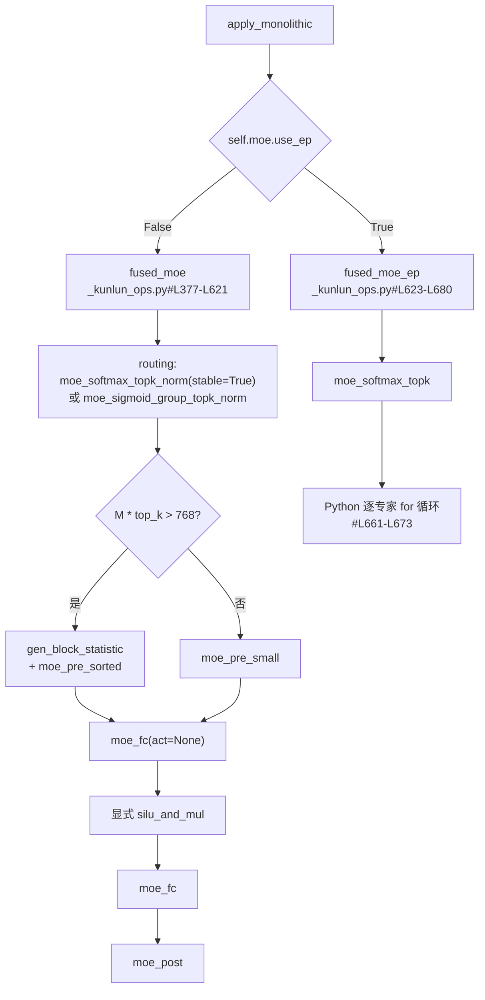

# Fused MoE 与专家并行

## 1. 挂载点

`ops/fused_moe/layer.py#L16-L17` ——
`@CustomOp.register_oot(name="UnquantizedFusedMoEMethod")`，
属于 [OOT 层注册](architecture.md#43-oot-层注册)。

`apply_monolithic`（`#L43-L89`）按 `self.moe.use_ep` 二分：



## 2. 非 EP 路径（`fused_moe`）

`ops/_kunlun_ops.py#L377-L621`。

**路由**：`moe_softmax_topk_norm(stable=True)` 或
`moe_sigmoid_group_topk_norm`（后者用于 DeepSeek 系的分组 topk）。

**大小 batch 分支**（`#L528`）：

```python
if M * moe_top_k > 768:
    # gen_block_statistic + moe_pre_sorted
else:
    # torch.ops.xspeedgate_ops.moe_pre_small
```

`M` 是 token 数，`M * moe_top_k` 是展开后的 token-expert 对数量。
`768` 是预处理 kernel 的切换阈值。也就是说同一个 MoE 层在 prefill 和
decode 下走的是两套不同 kernel：

- `M * moe_top_k <= 768`：使用 `moe_pre_small`；
- `M * moe_top_k > 768`：使用 `gen_block_statistic + moe_pre_sorted`。

两条路径最终都会生成后续 `moe_fc` 所需的排序 token、索引和专家分段信息。

`#L523-L526` 通过 `current_workspace_manager().get_simultaneous(...)` 拿工作区。
具体算子调用在 `#L547-L619`：`torch.ops._C.gen_block_statistic` /
`moe_pre_sorted` / `moe_fc` / `silu_and_mul` / `moe_post`。

`#L478-L496` 还有一条 `M * moe_top_k < 400` 的更小 batch 路径，**整块被注释掉**。

## 3. 关键：`act=None` + 显式 `silu_and_mul` 不是冗余写法

`ops/_kunlun_ops.py#L505-L519` 有一段必须原文引用的 NOTE：

> 当前版本暂不启用 `moe_fc(act="SWISH_GLU")` 融合；该能力待后续
> `kunlun_ops` kernel 支持后再接入。

当前所有 gated activation 都使用 `moe_fc(act=None)`，再显式调用对应的
`*_and_mul` 算子，然后执行第二个 `moe_fc`。这样可以明确保证
`activation(gate) * up` 的计算语义。

`SWISH_GLU` 后续支持后，可以在 FFN helper 中增加独立的 fused epilogue
路径，并重新验证不同 dtype 和 `M` 下的数值与性能。
排查"并发一高就输出乱码"类问题时，也应先确认这条规避是否还在。

## 4. 量化 int8 单体路径

`quantization/compressed_tensors/compressed_tensors_moe.py#L149-L321`
是上面 `fused_moe` 的 int8 镜像，**同样的 768 阈值**在 `#L200`。
两份实现需要同步维护。

## 5. EP 路径是 Python 逐专家循环

`ops/_kunlun_ops.py#L623-L680` 的 `fused_moe_ep`：
`torch.ops._C.moe_softmax_topk` 做路由，然后 `#L661-L673`
是一个**逐专家的 Python `for` 循环**。

**性能含义**：非 EP 路径是单个融合 kernel 处理所有专家，EP 路径是
`num_local_experts` 次独立 kernel launch。两条路径存在**量级上的性能不对称**。

这也解释了两件事：

1. 特性矩阵（`supported_features.md#L8-L14`）声称专家并行 🟢，
   但**所有 8 篇 tutorial 都是 TP-only**，没有一条命令用
   `--enable-expert-parallel` 或 `--data-parallel-size`。
2. `check_and_update_config` 里对 DeepEP 高吞吐 + DP>1 的组合直接
   **强制 full eager**（`platforms/kunlun.py#L257-L274`）——
   这条路径显然还没有和图捕获一起验证过。

## 6. 硬件验证结果

当前 `fused_moe_ep` 与普通 FP 路径共用 route/preprocess/FFN/combine 流水线。
映射 EP 保留固定的 `M*top_k` 行，使用 `-1` index 跳过非本地行，并在
combine 前将非本地 score 置零。

FP16/BF16 poison 实验覆盖 mixed/all-nonlocal route、eager 和 CUDA Graph
replay。硬件实测表明 FC kernel 不会可靠跳过所有未写入的 output 行；
未初始化的 `workspace.b` 会传播 NaN。因此 mapped EP 仅对整块
`workspace.b` 做一次 `zero_()`。control 与 poison 输出均 finite，
all-nonlocal 输出精确为零，Graph replay 改变输入后仍产生新结果。
full-local identity EP 不执行 map、mask 或 local histogram。

Graph median（local=32/global=128/top-k=8）为：FP16 M=1 约 90 us、M=97
约 321 us；BF16 M=512 约 672 us、M=2048 约 1169 us。旧 Python 逐专家
实现的 M=1 eager 基线约 4262 us，旧实现 Graph capture 因错误形状申请约
5.5 TiB 而失败。INT8 BF16 M=97 Graph smoke 约 74 us，输出 finite。

## 7. 相关环境变量

- `ENABLE_VLLM_MOE_FC_SORTED`（`platforms/envs.py#L53`，注释
  `fuse sorted op with fused_moe kernel`）——**没有消费者**，见
  [architecture.md](architecture.md#7-环境变量两套互不相交的集合)。
- `XPU_USE_MOE_SORTED_THRES` —— 厂商 legacy `moe_ffn_block` 根据 token
  行数 `M` 选择 sorted 路径的阈值，默认 `512`。当前 vLLM-Kunlun 的
  `fused_moe` 路径使用内部条件，不读取这个变量，因此启动脚本不再设置它。

## 相关页面

- [quantization.md](quantization.md) —— AWQ MoE 回落上游、W4A8 未实现
- [architecture.md](architecture.md) —— OOT 层注册机制
- [model-support.md](model-support.md) —— MoE 模型清单
